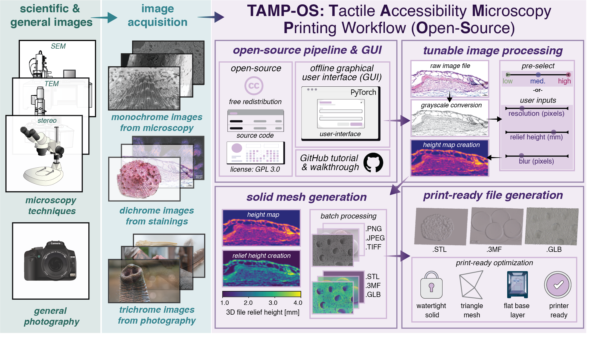
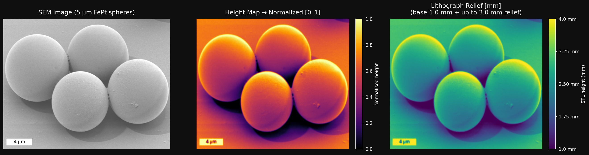

# TAMP-OS: Tactile Accessible Microscopy Printing (Open-Source)



**TAMP-OS** is an open-source extension and update of the original [TAMP](https://github.com/Aschulz94/TAMP) (Tactile Accessible Microscopy Printing) workflow for converting microscopy images into 3D-printable tactile lithographs. The original TAMP workflow was used by the co-authors to create 3D-printable lithographs of scanning electron microscopy images with additional details found in the supplemental materials of the [*Science*](https://www.science.org/doi/10.1126/science.adx8981) publication. 

[](https://www.science.org/doi/10.1126/science.adx8981)

After the publication, we received requests to make the workflow more streamlined and open-source, which is this extension page. This updated workflow has been submitted for publication and is currently under review, entitled "TAMP-OS: Tactile accessible microscopy printing workflow for open-source creation of 3D printable lithographs", by Natalia Gonzalez-Vazquez, Robert Faulkner, Victoria Gamez, Karly E. Cohen, Gunther Richter, Abigale Stang, and Andrew K. Schulz. Below there are easy access buttons to the original publication, preprint for TAMP-OS, and Edmond repository of the microscopy data used in this publication. 

[](https://arxiv.org/abs/2603.16801) [](https://edmond.mpg.de) [](https://github.com/nagova/TAMP-OS)  

---

## What is TAMP-OS

> **Built on [TAMP](https://github.com/Aschulz94/TAMP)** — the original Tactile Accessible Microscopy Printing workflow (Faulkner et al., *Science* 2026), which converts microscopy images into 3D-printed tactile lithographs using Bambu Lab hardware. The original workflow, figures, and README are preserved in [`tamp_original/`](tamp_original/).

TAMP makes scientific imagery accessible to blind and visually impaired people by converting microscopy images into 3D-printed tactile lithographs. The original workflow depended on Bambu Lab hardware and the proprietary Bambu Maker Lab slicer.

**TAMP-OS replaces that proprietary dependency with a fully open-source pipeline** that works with any FDM printer, gives full scripting control, and requires no hardware lock-in.

```
Microscopy Image → Height Map → STL → G-code → Any open-source printer → Tactile Lithograph
```

---

## Goals

- Make tactile science communication accessible to any lab, regardless of budget or hardware
- Provide a fully scriptable, automatable pipeline
- Be approachable for researchers with no programming experience
- Support multiple output formats (STL, 3MF, GLB) and printers

---

### Fabrication method

This pipeline produces **discrete extruded topology** — height maps converted to layered FDM (fused deposition modeling) prints. The nozzle diameter and layer height define the minimum feature size that can be physically reproduced.

This is distinct from **continuous microtopography fabrication** methods (e.g. photopolymer jetting, SLA, or specialized tactile printing systems), which can achieve finer surface gradients. If you are using a non-FDM printer, the nozzle-based preset calculations will not apply — use the **Full customization** panel and the sweep tool to determine your own optimal parameters.

---

### Why open-source?

The Bambu Lab ecosystem has three limitations for research use:
- **Proprietary slicer** — no scripting or automation support
- **No API control** — cannot integrate into larger pipelines
- **Hardware lock-in** — costly and not community-repairable

This pipeline uses only open-source tools and works with any FDM printer.

---

## Tools

### Main tool

| File | Format | Description |
|--------|--------|-------------|
| `tamp_batch_gui_v2.ipynb` | Jupyter notebook | **Start here.** Batch GUI with Low/Medium/High quality presets calculated from your printer's nozzle and layer height. Supports .STL, .3MF, .GLB output. |

> Note: Requires **Jupyter Lab or Jupyter Notebook** - not VS Code notebook viewer.

### Supporting tools

| File | Format | Description |
|--------|--------|-------------|
| `tamp_resolution_compare.ipynb` | Jupyter notebook | **Quality checking tool.** Run one image at multiple resolution, relief height, or blur values to find the best settings before a full batch run |
| `pyvista_image-generator.ipynb` | Jupyter notebook | **3D visualization tool.** Renders every STL in your comparison folder as a 3D screenshot (full view + zoom), useful for figures and presentations |

---

## Getting Started for non Python users 

Follow these steps if you have never used Python before.

### 1. Install Python

Download Python 3.10 or newer from:
 **https://www.python.org/downloads/**

> ⚠ On Windows, check **"Add Python to PATH"** during installation.

Verify it worked — open a terminal and type:
```
python --version
```
You should see something like `Python 3.11.2`.

### 2. Install dependencies

Open a terminal, go into the repo folder, and run:
```bash
pip install -r requirements.txt
```
You only need to do this once.

### 3. Install Jupyter Lab (if you don't have it)

```bash
pip install jupyterlab
jupyter lab
```

### 4. Open the main tool

In Jupyter Lab, open `tamp_batch_gui_v2.ipynb` and run all cells. The GUI window will appear.

---

## The Main Batch GUI (v2)

The v2 GUI is designed around a simple print workflow: add images, choose a printer profile, choose Low / Medium / High quality, and generate print-ready files. The profile represents the machine capacity, while **Full customization** keeps the detailed printer and mesh settings available when needed.

**How to use it:**

1. Click **Add images** to select one or more microscopy images
2. Choose a **printer profile** that roughly matches the printer's capacity
3. Select a **quality preset**:

| Preset | What it means |
|--------|--------------|
| **Low** | 1 pixel = 2 nozzle width. Smooth, small file. Good for quick checks. |
| **Medium** | 1 pixel = 1 nozzle width. Matches what your printer can actually reproduce. **Recommended starting point.** |
| **High** | 1 pixel = 0.5 nozzle width. Finer than the nozzle — captures more texture, larger file. |

Each preset card includes an approximate binary STL size. The estimate is based on the generated mesh triangle count, so it changes with resolution and image aspect ratio.

By default, one quality setting applies to the whole batch. For mixed image sets, check **Choose different quality for different images** to reveal a per-image table with suggested quality and a Low / Medium / High override.

4. Choose the **output folder** and **output format**
5. Click **Generate print files**

The default output is `.STL`. Open **Full customization** only when you need to change print size, nozzle diameter, layer height, relief height, blur, resolution, base thickness, flip, or invert relief.

---

## Quality Checking Before a Full Batch Run

Before processing many images, use `tamp_resolution_compare.ipynb` to find the best settings for your specific image and printer.

It runs **one image** at multiple values of one parameter (resolution, relief height, or blur) and saves clearly named files — e.g. `elephant_resolution_128.stl`, `elephant_resolution_256.stl` — so you can compare them side by side in MeshLab or PrusaSlicer.

**Recommended workflow:**
1. Run `tamp_resolution_compare.ipynb` on one representative image
2. Open the output STL files in MeshLab to compare, or use `pyvista_image-generator.ipynb` to render them all as 3D screenshots automatically
3. Pick the settings that look best
4. Use those settings in `tamp_batch_gui_v2.ipynb` for the full batch

The figure below shows an example comparison matrix — each row sweeps one parameter while holding the others fixed. This makes it easy to isolate the effect of blur, relief height, and resolution independently.


*left column: blur sweep (resolution=256, relief=3.0 mm). Middle column: relief height sweep (resolution=256, blur=1.2). Right row: resolution sweep (relief=3.0 mm, blur=1.2).*

---

## 3D Visualization of Comparison Results

After running `tamp_resolution_compare.ipynb`, use `pyvista_image-generator.ipynb` to render all your output STLs as 3D images without opening MeshLab manually.

It reads every `.stl` file in your comparison output folder and saves two renders per file:
- **Full view** — the whole lithograph from an isometric angle
- **Zoom view** — a close-up of the center to show surface detail

Both dark and light themes are available. The output PNGs can be used directly in figures and presentations.

**How to use it:**
1. Run `tamp_resolution_compare.ipynb` first to generate the STL files
2. Open `pyvista_image-generator.ipynb`
3. Set `STL_FOLDER` to your comparison output folder
4. Choose `THEME = "dark"` or `THEME = "light"`
5. Run the cell — renders are saved to `individual_renders/` and `zoom_renders/`

> ⚠ Install dependencies with: `pip install pyvista trame`

---

## Choosing Parameters Based on Your Printer

The Low / Medium / High presets in the v2 GUI are calculated from your printer's nozzle diameter and layer height. The table below shows what those presets translate to for the most common nozzle sizes, assuming a 100 mm wide print.

The right choice depends on your **machine**, **material**, and **time available** — but the sweep tool makes it easy to verify visually before committing to a full batch.

The GUI now gives a first-pass recommendation from the image itself. Large images with strong edge detail often justify High resolution, smooth or low-pixel-count images may be fine at Low, and clipped or low-contrast images should be checked with a parameter sweep because flat tones can become flat tactile plateaus.

| Nozzle | Preset | Resolution | Blur | 1 px on print | Notes |
|--------|--------|-----------|------|---------------|-------|
| 0.4 mm | Low    | 128 px | 2.0 | 0.78 mm | Fast print, smooth feel, small file |
| 0.4 mm | Medium | 256 px | 1.2 | 0.39 mm | Matches nozzle — **recommended starting point** |
| 0.4 mm | High   | 512 px | 0.8 | 0.20 mm | Finer than nozzle, captures more texture |
| 0.6 mm | Low    | 64 px  | 2.0 | 1.56 mm | Very smooth, very fast |
| 0.6 mm | Medium | 128 px | 1.2 | 0.78 mm | Matches nozzle |
| 0.6 mm | High   | 256 px | 0.8 | 0.39 mm | Finer than nozzle |
| 0.2 mm | Low    | 256 px | 2.0 | 0.39 mm | Matches a 0.4 mm Medium |
| 0.2 mm | Medium | 512 px | 1.2 | 0.20 mm | High detail, large file |
| 0.2 mm | High   | 512 px | 0.8 | 0.20 mm | Capped at 512 px (GitHub file size limit) |

> 💡 These are starting points — the optimal settings also depend on the image itself. A high-contrast SEM image (sharp edges, lots of noise) may need more blur even at Medium resolution. A smooth fluorescence image may look great at Low. Use `tamp_resolution_compare.ipynb` to check your specific image before running a full batch.

> 💡 If you want full control, the **Full customization** panel in the v2 GUI lets you override resolution, blur, and base thickness independently of any preset. You can also work directly with the STL and adjust slicing settings in PrusaSlicer for further control.

---

## Workflow Steps

### 1. Prepare your image in ImageJ/Fiji

- **Crop out any scale bars, metadata bars, or annotations** at the bottom of the image — these will appear as raised features in the lithograph
- Export as `.PNG` or `.JPG`

> 💡 The pipeline converts your image to grayscale automatically. If you want finer control over which features become raised vs recessed (e.g. isolating a specific channel or adjusting contrast manually), convert to grayscale in ImageJ/Fiji before exporting — but this is optional, not required.

> 💡 For images with very fine detail, you can apply a Gaussian blur (radius = 1.0 pixel) in ImageJ/Fiji before exporting, or simply adjust the blur parameter in the GUI.

---

### 2. Check your image dimensions and set print size

- Your physical print size must match the image aspect ratio — **the print does NOT have to be square**
- Leave print height as `auto` and the tool calculates it for you
- If you set it manually and it doesn't match, the script will warn you:

```
[WARNING] Aspect ratio mismatch!
    Height map is 512×384 (ratio 1.333)
    Print size is 100×100 mm (ratio 1.000)
    The lithograph will appear stretched. Consider size_y=75.0
```

| Image pixels | Correct print size |
|---|---|
| 1024 × 1024 (square) | size_x=100, size_y=100 |
| 1024 × 768 (4:3) | size_x=100, size_y=75 |
| 1920 × 1080 (16:9) | size_x=100, size_y=56.3 |

---

### 3. Generate the STL

Open `tamp_batch_gui_v2.ipynb` in Jupyter Lab, add your images, choose your quality preset, and click **Generate STLs**.

---

### 4. Slice and print

**Manual (any slicer):**
- Load the `.stl` into PrusaSlicer, OrcaSlicer, or Cura
- Recommended FDM settings:
  - Layer height: **0.12 mm**
  - Nozzle: **0.4 mm**
  - Infill: **15%** (gyroid)
  - Supports: **none needed** (flat base)

---

## Recommended Printers

| Printer | Firmware | Notes |
|---------|----------|-------|
| **Prusa MK4 / XL** | Marlin | Most plug-and-play, good for labs |
| **Voron 2.4** | Klipper | Best for full automation via Moonraker API |
| Any Marlin/Klipper printer | — | Works with PrusaSlicer profiles |

---

## Troubleshooting

**`python: command not found` / `pip: command not found`**
→ Python is not installed or not in PATH. Re-install from https://www.python.org/downloads/ and check "Add Python to PATH" on Windows.

**`ModuleNotFoundError: No module named 'numpy'` (or pillow, scipy, stl)**
→ Run `pip install -r requirements.txt` from the repo root.

**The STL looks stretched or squished**
→ Print height doesn't match the image aspect ratio. Leave size_y as `auto` or check the warning message for the suggested value.

**The STL is mirrored**
→ Make sure "Flip vertically" is checked in the GUI, or that `--no-flip` is not set in the CLI.

**The relief is too subtle or too extreme**
→ Adjust relief height. Start with 3.0 mm. Use `tamp_resolution_compare.ipynb` to test values before a full batch run.

**The GUI window doesn't appear (Jupyter)**
→ Use Jupyter Lab or Jupyter Notebook. Does not work in VS Code's notebook viewer.

**PrusaSlicer not found**
→ Pass the full path with `--prusaslicer`. See examples in Step 4 above.

**STL file is too large for GitHub (>25 MB)**
→ Use the Low preset, or reduce `--resolution` to 256 in the CLI.

---

## Example Output

Input: `SEM_5um_raw.png` — FePt spherical particles, 5 µm scale



---

## Files

| File | Description |
|------|-------------|
| `tamp_batch_gui_v2.ipynb` | **Main tool** — batch GUI with quality presets |
| `tamp_resolution_compare.ipynb` | Supporting — quality checking before batch runs |
| `pyvista_image-generator.ipynb` | Supporting — 3D rendering of comparison STLs for figures |
| `requirements.txt` | Python dependencies |

---

## Pipeline Details

All notebooks are self-contained — no external scripts needed. The pipeline runs these steps internally:

| Step | Function | Description |
|------|----------|-------------|
| 1 | `image_to_heightmap` | Grayscale → contrast stretch → Gaussian blur → flip → [0,1] float array |
| 2 | `heightmap_to_stl` | Builds watertight solid mesh: top relief + flat base + 4 side walls |
| 3 | Format conversion | Converts STL to .3MF or .GLB if selected |

---

## Citation

If you use TAMP-OS in your work, please cite:

```bibtex
@article{faulkner_tamp_2026,
  title   = {A low-data, low-cost, and open-source workflow for 3D printing lithographs
             for digital accessibility of microscopy images},
  author  = {Faulkner, Robert and Gonzalez-Vazquez, Natalia and Gamez, Victoria and
             Cohen, Karly E. and Richter, Gunther and Stangl, Abigale and Schulz, Andrew K.},
  journal = {Science},
  year    = {2026},
  doi     = {10.1126/science.adx8981},
}
```

---

## Acknowledgements

The authors are grateful for the support of the **Tactile Media Alliance**. A.K.S. acknowledges support from the **Alexander von Humboldt Foundation**. G.R. and A.K.S. acknowledge support from the **Max Planck Society**.

---

## Contact

Authored and maintained by:

- **Natalia Gonzalez-Vazquez** — https://github.com/nagova
- **Andrew K. Schulz** — https://github.com/Aschulz94

For questions or issues, open a ticket on [GitHub](https://github.com/nagova/TAMP-OS/issues).

If you find this repository useful, consider giving it a ⭐

---

## License

This project is licensed under the GNU GPL version 3 — see the [LICENSE](LICENSE) file for details.

## Copyright

© 2026, Max Planck Society
