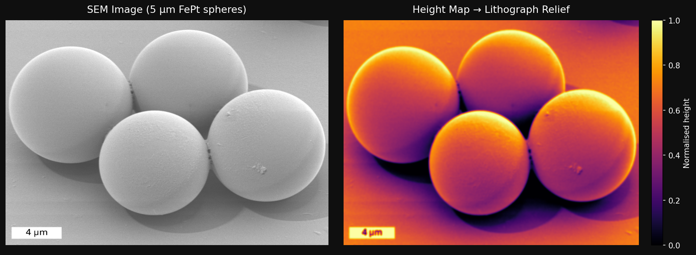

# Open-Source Printing Pipeline

This subfolder extends the TAMP workflow to replace Bambu Lab with a fully open-source stack, giving programmatic control over every step from microscopy image to printed lithograph.

```
Microscopy Image → Height Map → STL → G-code (PrusaSlicer) → Printer (Klipper/Prusa)
```

### Why open-source?

The Bambu Lab ecosystem has three limitations for research use:
- **Proprietary slicer** — no scripting or automation support
- **No API control** — cannot integrate into larger pipelines
- **Hardware lock-in** — costly and not community-repairable

This pipeline uses only open-source tools and works with any FDM printer.

---

## Tools

| File | Format | Description |
|--------|--------|-------------|
| `tamp_litho.py` | Python script | Command-line pipeline — single image, full control |
| `tamp_batch_gui.py` | Python script | GUI tool — select many images at once, process in batch |
| `tamp_litho.ipynb` | Jupyter notebook | Same as `tamp_litho.py` but step-by-step cells + inline preview |
| `tamp_batch_gui.ipynb` | Jupyter notebook | Same as `tamp_batch_gui.py` but in notebook form |

> ⚠️ **Jupyter notebook users:** The batch GUI notebook (`tamp_batch_gui.ipynb`) launches a tkinter window and requires **Jupyter Lab or Jupyter Notebook** to work. It will **not** display the GUI window inside VS Code's notebook viewer.

---

## Getting Started from Zero

Follow these steps if you have never used Python before.

### 1. Install Python

Download Python 3.10 or newer from:
→ **https://www.python.org/downloads/**

> ⚠️ On Windows, check **"Add Python to PATH"** during installation.

Verify it worked — open a terminal and type:
```
python --version
```
You should see something like `Python 3.11.2`.

### 2. Install dependencies

Open a terminal, go into this folder, and run:
```bash
pip install -r requirements.txt
```
You only need to do this once.

### 3. Run the GUI

```bash
python tamp_batch_gui.py
```

---

## The Batch GUI


The GUI lets you process multiple images at once without using the command line:

1. Click **+ Add Images** to select one or more microscopy images
2. Click **Browse** to choose where the STL files will be saved
3. Set your parameters (see [All Options](#all-options) below)
4. Click **▶ Generate STLs** — a progress bar shows each file being processed

---

## Workflow Steps

### 1. Prepare your image in ImageJ/Fiji

- Convert to grayscale
- For images with very fine detail (1–2 pixel precision), apply a Gaussian blur (radius = 1.0 pixel) — or use `--blur 1.0` in the script instead
- **Crop out any scale bars, metadata bars, or annotations** at the bottom of the image — these will appear as raised features in the lithograph
- Export as `.PNG` or `.JPG`

> 💡 The script handles grayscale conversion and blur internally, so you can also feed in a raw export directly and tune `--blur` from the command line.

---

### 2. Check your image dimensions and set print size

- Note your image's pixel dimensions (e.g. 1024×768)
- Your physical print size must match this aspect ratio — **the print does NOT have to be square**
- If the ratio is wrong, the script will warn you automatically and suggest the correct `--size-y`

| Image pixels | Print flags |
|---|---|
| 1024 × 1024 (square) | `--size-x 100 --size-y 100` |
| 1024 × 768 (4:3) | `--size-x 100 --size-y 75` |
| 1920 × 1080 (16:9) | `--size-x 100 --size-y 56.3` |

> ⚠️ If `--size-x` and `--size-y` don't match your image's aspect ratio, the script will warn you:
> ```
> [WARNING] Aspect ratio mismatch!
>     Height map is 512×384 (ratio 1.333)
>     Print size is 100×100 mm (ratio 1.000)
>     The lithograph will appear stretched. Consider --size-y 75.0
> ```

---

### 3. Generate the STL file

**Single image — command line:**

```bash
python tamp_litho.py your_image.png \
  --size-x 100 --size-y 75 \
  --base-thickness 1.0 \
  --relief-height 3.0 \
  --blur 1.2 \
  --skip-slice
```

**Multiple images — batch GUI:**

```bash
python tamp_batch_gui.py
```

A window will open where you can:
- Select as many images as you want at once
- Set all parameters (size, relief height, blur, resolution, flip)
- Choose an output folder
- Click **▶ Generate STLs** — a progress bar shows each file being processed

> 💡 No extra installs needed for the GUI — tkinter is built into Python.

This produces `.stl` files in your chosen output folder. Open them in [MeshLab](https://www.meshlab.net/) or PrusaSlicer to inspect the relief before printing.

> 💡 Use `--invert` (CLI) or the invert checkbox (GUI) if your image has bright backgrounds and dark features (e.g. some TEM images) — this flips which areas become raised.

---

### 4. Slice and print

**Option A — Manual (any slicer):**
- Load the `.stl` into PrusaSlicer, OrcaSlicer, or Cura
- Recommended FDM settings:
  - Layer height: **0.12 mm**
  - Nozzle: **0.4 mm**
  - Infill: **15%** (gyroid)
  - Supports: **none needed** (flat base)

**Option B — Automated via script:**
```bash
python tamp_litho.py your_image.png \
  --size-x 100 --size-y 75 \
  --prusaslicer /path/to/prusa-slicer \
  --layer-height 0.12
```

> 💡 Finding PrusaSlicer on your system:
> - **Linux:** `which prusa-slicer`
> - **macOS:** `/Applications/PrusaSlicer.app/Contents/MacOS/PrusaSlicer`
> - **Windows:** `C:\Program Files\Prusa3D\PrusaSlicer\prusa-slicer-console.exe`

**Option C — Send directly to printer (Klipper only):**
```bash
python tamp_litho.py your_image.png \
  --size-x 100 --size-y 75 \
  --moonraker-host http://192.168.1.42:7125 \
  --start-print
```

---

## All Options

These parameters appear in both the **GUI** and the **command-line** script (`tamp_litho.py`).

| GUI label | CLI flag | Default | What it does |
|-----------|----------|---------|--------------|
| Print width (mm) | `--size-x` | 100 mm | Physical width of the final print in mm |
| Print height (mm) | `--size-y` | 100 mm | Physical height of the final print in mm — **must match your image's aspect ratio** or the lithograph will look stretched |
| Relief height (mm) | `--relief-height` | 3 mm | Height difference between the lowest and highest point of the tactile surface. Higher = more pronounced bumps. Start with 3.0 mm for a first print |
| Base thickness (mm) | `--base-thickness` | 1 mm | Thickness of the solid flat base below the relief. Keeps the print rigid |
| Blur (sigma) | `--blur` | 1.0 | Gaussian smoothing applied before height mapping. Increase for noisier images (e.g. 1.5–2.0 for low-quality SEM). Too high = loss of detail |
| Resolution (px) | `--resolution` | 512 | Height map resolution in pixels (longest side). Higher = more detail but larger STL file. 256 = ~10 MB, 512 = ~40 MB |
| Invert relief | `--invert` | off | Flips which areas become raised. Use if your image has bright backgrounds and dark features (e.g. some TEM images) |
| Flip vertically | *(on by default)* | on | Corrects the Y-axis flip between image coordinates and 3D space so the print matches the original image orientation. Only disable with `--no-flip` if you have a specific reason |

### CLI-only options (slicing & printing)

| CLI flag | Default | What it does |
|----------|---------|--------------|
| `--layer-height` | 0.12 mm | FDM layer height for slicing |
| `--skip-slice` | off | Stop after generating the STL, skip slicing |
| `--printer-profile` | — | Path to a PrusaSlicer `.ini` config for your specific printer |
| `--moonraker-host` | — | URL of your Klipper printer (e.g. `http://192.168.1.42:7125`) for direct upload |
| `--start-print` | off | Automatically start the print after uploading to Klipper |

---

## Recommended Printers

| Printer | Firmware | Notes |
|---------|----------|-------|
| **Prusa MK4 / XL** | Marlin | Most plug-and-play, good for labs |
| **Voron 2.4** | Klipper | Best for full automation via Moonraker API |
| Any Marlin/Klipper printer | — | Works with PrusaSlicer profiles |

---

## Troubleshooting

**`python: command not found` / `pip: command not found`**
→ Python is not installed or not in PATH. Re-install from https://www.python.org/downloads/ and make sure to check "Add Python to PATH" on Windows.

**`ModuleNotFoundError: No module named 'numpy'` (or pillow, scipy, stl)**
→ Dependencies are not installed. Run `pip install -r requirements.txt` from inside the `open_source_printing/` folder.

**`ModuleNotFoundError: No module named 'tamp_litho'` (when running the GUI)**
→ Make sure `tamp_batch_gui.py` and `tamp_litho.py` are in the same folder and you are running the script from that folder.

**The STL looks stretched or squished**
→ Your `--size-x` and `--size-y` don't match the image aspect ratio. Check the warning printed by the script and use the suggested `--size-y` value.

**The STL is mirrored compared to the original image**
→ Make sure `--no-flip` is NOT set. Flip is on by default and corrects the Y-axis orientation. In the GUI, make sure "Flip vertically" is checked.

**The relief is too subtle / too extreme**
→ Adjust `--relief-height`. Start with `3.0` mm. Go up to `5.0` for more pronounced bumps, or down to `1.5` for a smoother feel.

**The GUI window doesn't appear (Jupyter)**
→ The batch GUI requires **Jupyter Lab or Jupyter Notebook**. It will not work in VS Code's notebook viewer. Run `python tamp_batch_gui.py` directly from the terminal instead.

**PrusaSlicer not found**
→ Pass the full path to the executable with `--prusaslicer`. See the path examples in [Step 4](#4-slice-and-print) above.

**STL file is too large for GitHub (>25 MB)**
→ Reduce `--resolution` to `256`. This brings the file size to ~10 MB with minimal loss of printable detail.

---

## Example Output

Input: `SEM_5um_raw.png` — FePt spherical particles, 5 μm scale



Generated with:
```bash
python tamp_litho.py examples/SEM_5um_raw.png \
  --size-x 100 --size-y 75 \
  --relief-height 3.0 --blur 1.2
```

---

## Files

| File | Description |
|------|-------------|
| `tamp_litho.py` | Core pipeline: image → height map → STL → G-code → printer |
| `tamp_litho.ipynb` | Jupyter notebook version of the pipeline with inline preview |
| `tamp_batch_gui.py` | Tkinter GUI for batch processing multiple images |
| `tamp_batch_gui.ipynb` | Jupyter notebook version of the batch GUI ⚠️ requires Jupyter Lab/Notebook |
| `requirements.txt` | Python dependencies |

## Pipeline Details

| Step | Function | Description |
|------|----------|-------------|
| 1 | `image_to_heightmap` | Grayscale → contrast stretch → Gaussian blur → flip → [0,1] float array |
| 2 | `heightmap_to_stl` | Builds watertight solid mesh: top relief + flat base + 4 side walls |
| 3 | `slice_stl` | Calls PrusaSlicer CLI; pass a `.ini` profile for your printer |
| 4 | `send_to_klipper` | Moonraker REST API upload + optional print start |
